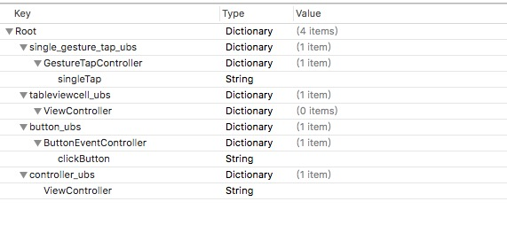

# Aopubs
Aopubs是使用AOP编程针对IOS客户端实现的用户行为统计（User Behavior statistics），也叫叫埋点。什么是埋点？埋点指的是针对特定用户行为或事件进行捕获、处理和发送的相关技术及其实施过程。

## Function
1. 实现对controller加载显示和消失的统计
2. 实现对UIButton事件的统计
3. 实现对UITapGestureRecognizer事件的统计
4. 实现对UITableViewCell点击事件的统计
5. 对所有的target为controller的事件统计

## Policy
当对用户的行为统计超过10次，则进行上传。每次关闭app或进入后台，会将没上传的用户行为写入沙盒文件中保存下来，以便数据丢失，下次打开app后再继续上传数据。

## Requirements

* iOS 8.0 or later
* Xcode 7.3 or later

## Installation
pod install Aopubs

## How to use

1.添加配置文件AopusbConfig.plist，并在其中指定相应的key-value 其中4个key为指定的，分别是single_gesture_tap_ubs、tableviewcell_ubs、button_ubs、controller_ubs；对应不同的用户行为事件。

 * single_gesture_tap_ubs ----单击事件
 * tableviewcell_ubs--------表格点击事件
 * button_ubs----------------按钮点击事件
 * controller_ubs ------------controller 的加载事件
 
#####如图所示：

2.在AppDelegate.m文件中添加如下代码：

	#import "Aopubs.h"
	#import "AopubsCache.h"

	- (BOOL)application:(UIApplication *)application didFinishLaunchingWithOptions:(NSDictionary *)launchOptions {
	    // Override point for customization after application launch.
	    
	    [[Aopubs shareInstance] defaultConfig];
	
	    return YES;
	}

# more
详情或源码请看Example。